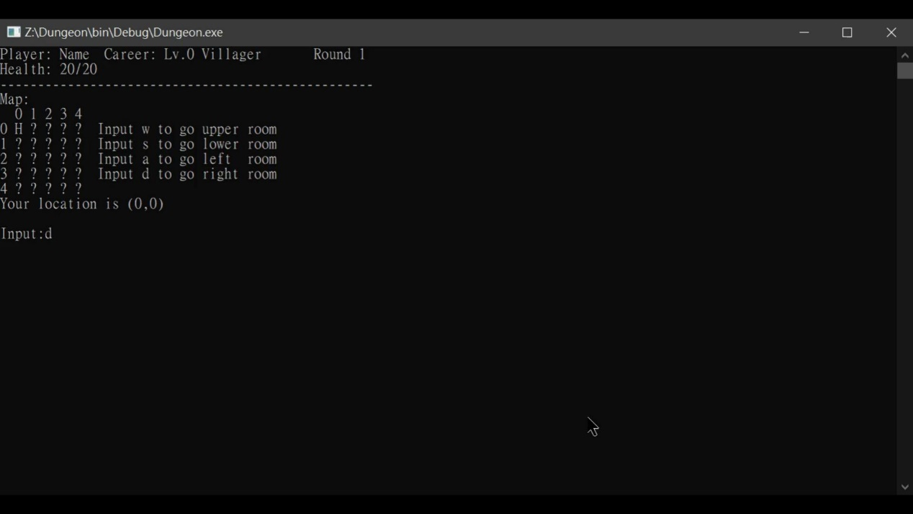

# Dungeon

A text-based dungeon adventure game where players explore rooms, fight monsters, and manage resources to reach the boss room.

## Features

- **Multiple Character Classes**
  - Knight: Balanced warrior
  - Archer: Ranged specialist
  - Wizard: Magic user
  - Worker: Resource management specialist

- **Resource Management**
  - Collect copper and wood for factory upgrades
  - Manage money for item purchases
  - Build ladders for quick boss room access

- **Factory System**
  - Upgrade various factories (Armor, Arrow, Axe)
  - Build Magic Towers
  - Special abilities unlock at higher levels

- **Dynamic Gameplay**
  - Monster encounters
  - NPC interactions with class-specific dialogues
  - Shop system for item purchases
  - Monster respawn system (every 60 turns)

## Building the Game

### Prerequisites
- C++ compiler (g++ recommended)
- Make

### Build Instructions
1. Clone the repository
2. Run `make` to build the game
3. Execute the game with `./dungeon`

To clean build files:
```bash
make clean
```

## Game Structure

### Core Components
- `Dungeon`: Main game engine
- `Player`: Player character management
- `Room`: Room system and navigation
- `Factory`: Resource and upgrade management
- `GameCharacter`: Base class for all characters
- `Monster`: Enemy system
- `NPC`: Non-player character interactions

### Game Flow
1. Start game and create player
2. Explore rooms and collect resources
3. Interact with NPCs for guidance
4. Upgrade factories and build ladders
5. Fight monsters and reach the boss room

## Screenshots

### Game Start

- Initial game screen with title and welcome message
- Displays the game's main menu interface
- Shows available options to begin the adventure

### Character Selection

- Player name input screen
- Choose your character's name before starting
- Sets up your initial character identity

### Room Navigation

- Main game interface showing room layout
- Displays available movement directions
- Shows current room status and surroundings

### Home Interface

- Safe haven where players can:
  - Rest and recover health
  - Access factory upgrades
  - Change character class
  - Build ladders (requires Worker level 3)

### Combat System

- Monster encounter interface
- Shows combat options and status
- Displays health, attack, and defense information
- Allows for strategic combat decisions

### Factory Management

- Factory upgrade interface showing:
  - Available factory types (Armor, Arrow, Axe)
  - Current factory levels
  - Required resources for upgrades
  - Special abilities unlocked at higher levels

### Resource Collection

- Resource gathering interface
- Shows collected items (copper, wood)
- Displays inventory status
- Resource management system

### Boss Room Access

- Final challenge interface
- Boss room entrance
- Shows ladder placement option
- Displays final battle preparation

### Additional Game Features

- NPC dialogue system
- Class-specific conversations
- Quest information and guidance


- Item purchase system
- Available equipment and upgrades
- Currency management


- Character progression
- Level-based abilities
- Class-specific upgrades


- Class-specific powers
- Wizard's fire ability
- Worker's resource gathering bonus


- Monster regeneration system
- 60-turn respawn timer
- Dynamic dungeon population

## License

This project is released into the public domain under the Unlicense. See [LICENSE](LICENSE) for details.

## UML Design

