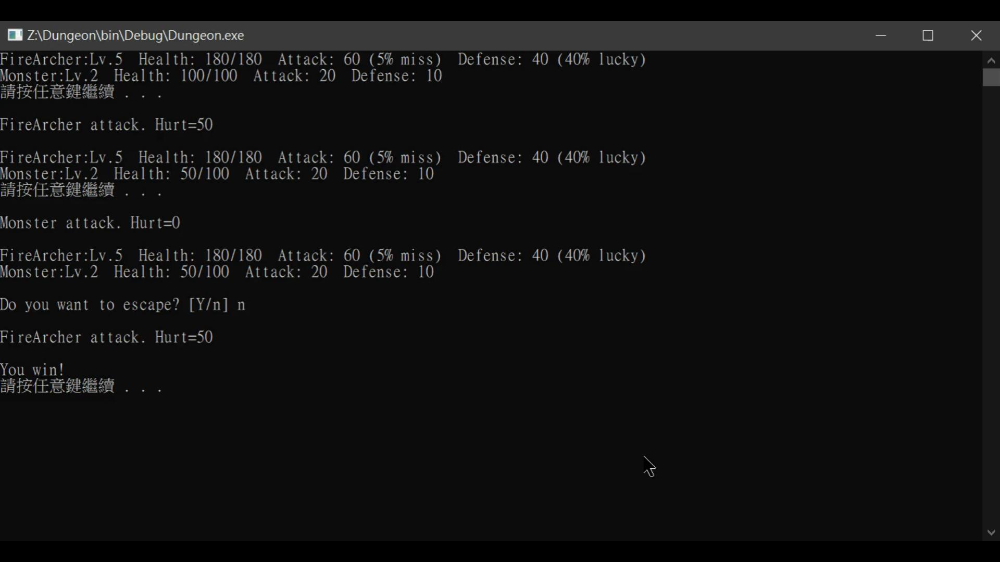

# Dungeon

Implementation detailed

- void startGame(): Deal with all game initial setting, including create player, create map etc.
    - void createPlayer(): Create a new player, ask player what name he/she want.
    - void setMember(): Initialize set member status including name, lv, tag, etc.
    - void createMap(): Create a map, which include several different rooms.
- void runDungeon(): Deal with the whole game process
    - bool checkGameLogic(): Check whether to end the game or not.
    - bool isAlive(): If he/she dead, return true
- void printTitle(), void printMap(), void printMoveMap(): Print Game screen.
- void handleMovement(): Dealing with the player's moving action and updating the current room
- void handleEvent(): Deal with player's interaction with objects in that room
    - Home: void homeEvent(): Including
        - Recover health
        - Change career: including Knight, Archer, Wizard, Worker.
        - Update Factory: including Armor, Arrow, Axe Factories and Magic Tower
        - Build Ladder: use for enter boss room(the goal) quicker.
    - Copper, Wood: Get item which can upgrade Factories
    - Money: Get money to buy items
    - Monster, Boss: char fight(Player*, Monster*): Allows the player to engage in combat with monsters.
    - NPC: Told player what to do to reach his/her goal.
    - Shop: Place to buy your item.
    - Ladder: Only place to place Ladder.

UML Design

**Results**

⇧初始畫面

⇧輸入名稱

⇧Enter Home?

⇧移動

⇧第一次走到Empty space會告訴你這格Empty

⇧Villager遇到NPC

⇧進Home，選擇到Factory或Incinerator或繼續冒險

⇧進Factory選擇，輸入1換角色，輸入2繼續冒險

⇧換角色結果

⇧NPC遇到不同角色會有不同對話

⇧踩到Monster格

⇧Fight並成功逃出

⇧Get Copper

⇧Get Wood

⇧撞到牆(該方向為nullptr)

⇧NPC對話

⇧NPC對話

⇧背包滿了

⇧選擇升級Factory(此選項須問過NPC才會顯示)

⇧升級成功

⇧升級至最高級別

⇧若工廠升級至最高級別將不會顯示所需升級物資

⇧當Worker = Lv3時，拿到物品(不含錢)加倍

⇧選擇建造Ladder(當Worker = Lv3且Wood>5時顯示此功能)

⇧Get Ladder

⇧Wizard = Lv3且問過NPC後可以Set Fire

⇧NPC對話

⇧Worker Lv>=3時可以點火(點火會增加攻擊力)

⇧Fight and Win

⇧Get Money

⇧Ladder格可以置放Ladder，可以快速進出Boss Room

⇧每60回合Monster會復活

⇧逃出Dungeon結束畫面